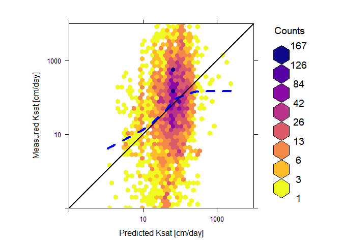
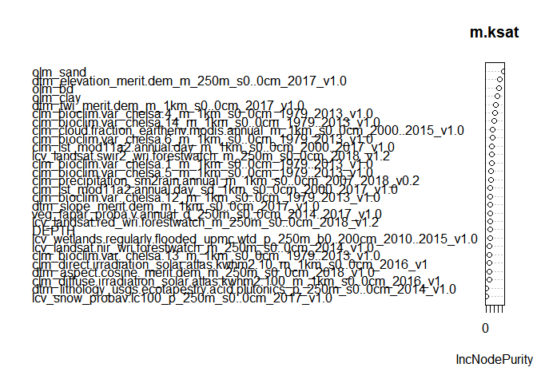

Global prediction of soil saturated hydraulic conductivity using random
forest in a Covariate-based Geo Transfer Functions (CoGTF) framework
================
Surya Gupta, Tom Hengl, Peter Lehmann, Sara Bonetti, Dani Or

``` r
library(caret)
```

    ## Loading required package: lattice

    ## Loading required package: ggplot2

``` r
library(randomForest)
```

    ## randomForest 4.6-14

    ## Type rfNews() to see new features/changes/bug fixes.

    ## 
    ## Attaching package: 'randomForest'

    ## The following object is masked from 'package:ggplot2':
    ## 
    ##     margin

``` r
library(ranger)
```

    ## 
    ## Attaching package: 'ranger'

    ## The following object is masked from 'package:randomForest':
    ## 
    ##     importance

``` r
library(mlr)
```

    ## Loading required package: ParamHelpers

    ## 'mlr' is in maintenance mode since July 2019. Future development
    ## efforts will go into its successor 'mlr3' (<https://mlr3.mlr-org.com>).

    ## 
    ## Attaching package: 'mlr'

    ## The following object is masked from 'package:caret':
    ## 
    ##     train

``` r
library(tibble)
library(raster)
```

    ## Loading required package: sp

    ## 
    ## Attaching package: 'raster'

    ## The following object is masked from 'package:mlr':
    ## 
    ##     resample

    ## The following object is masked from 'package:ParamHelpers':
    ## 
    ##     getValues

``` r
library(sp)
library(rgdal)
```

    ## rgdal: version: 1.5-12, (SVN revision 1018)
    ## Geospatial Data Abstraction Library extensions to R successfully loaded
    ## Loaded GDAL runtime: GDAL 3.0.4, released 2020/01/28
    ## Path to GDAL shared files: C:/Users/guptasu.D/Documents/R/win-library/3.6/rgdal/gdal
    ## GDAL binary built with GEOS: TRUE 
    ## Loaded PROJ runtime: Rel. 6.3.1, February 10th, 2020, [PJ_VERSION: 631]
    ## Path to PROJ shared files: C:/Users/guptasu.D/Documents/R/win-library/3.6/rgdal/proj
    ## Linking to sp version:1.4-2
    ## To mute warnings of possible GDAL/OSR exportToProj4() degradation,
    ## use options("rgdal_show_exportToProj4_warnings"="none") before loading rgdal.

``` r
library(hexbin)
library(lattice)
library(RColorBrewer)
library(viridis)
```

    ## Loading required package: viridisLite

``` r
library(Metrics)
```

    ## 
    ## Attaching package: 'Metrics'

    ## The following objects are masked from 'package:caret':
    ## 
    ##     precision, recall

``` r
tt2<-read.csv("E:/Ksat_dataset_mapping.csv")

## Unique IDs for 5 degrees by 5 degrees

unique(tt2$FID_Fish_n)
```

    ##   [1]  271  270 1503 1312 1158 1231 1167 1090 1342 1386 1807 1802 1615 1618 1685
    ##  [16] 1589 1647 1341 1200  873 1273 1434  136 1277 1205 1409 1613 1276 1206 1275
    ##  [31] 1414 1176  925 1202 1274 1363 1344  856 1238  872 1228 1502 1100  825 1646
    ##  [46]  823  822  824  202 1347 1268  443 1168 1340 1098 1097 1136 1135  653  444
    ##  [61]  442  718  302  724  512  584  721 1243 1242 1240 1408 1504 1505 1506 1051
    ##  [76] 1050  943  207  277 1365 1248 1390 1438 1204 1575 1574 1433 1294  871  939
    ##  [91] 1580 1441 1301 1302 1345 1271 1222 1232 1295 1314 1171 1362 1292 1291 1435
    ## [106] 1436  944 1028  945  874 1199 1229 1432  372 1031  406  720 1163 1367 1297
    ## [121] 1093  804 1203  371 1234 1385  809 1501 1571  335 1550 1481  298 1316 1244
    ## [136] 1315 1174 1387 1246  740 1062 1162 1021  388  949 1415 1412  669 1226  525
    ## [151]  526  481  802  299 1360 1346 1227  717  229 1154  619 1337  341  455  340
    ## [166]  300  483  752

``` r
source("E:/OpenLandMap/R/saveRDS_functions.R")
source("E:/OpenLandMap/R/LandGIS_functions.R")

## saveRDS_functions.R and LandGIS_functions.R available at https://github.com/Envirometrix/LandGISmaps/tree/477460d1d0099646c508f65e68769b9edf050ce8/functions

## 3D modeling (see Hengl, T., & MacMillan, R. A. (2019). Predictive soil mapping with R. Lulu. com.)

dfs <- hor2xyd(tt2, U="hzn_top", L="hzn_bot")


I.vars = make.names(unique(unlist(sapply(c("s.no","clm_", "dtm_", "lcv", "veg_", "olm_c", "olm_s", "olm_bd", "FID_Fish_", "DEPTH"), function(i){names(dfs)[grep(i, names(dfs))]}))))

t.vars = c("log_ksat")
sel.n <- c(t.vars,I.vars)
sel.r <- complete.cases(dfs[,sel.n])
PTF_temp2 <- dfs[sel.r,sel.n]

##Set1
set.seed(16)
chosen <- sample(unique(PTF_temp2$FID_Fish_n), 30)

ff<-subset(PTF_temp2, FID_Fish_n %in% chosen)

final<-PTF_temp2[!(PTF_temp2$FID_Fish_n %in% ff$FID_Fish_n),]

set.seed(6)
chosen <- sample(unique(final$FID_Fish_n), 30)

ff1<-subset(final, FID_Fish_n %in% chosen)

final1<-final[!(final$FID_Fish_n %in% ff1$FID_Fish_n),]


set.seed(11)
chosen <- sample(unique(final1$FID_Fish_n), 30)

ff2<-subset(final1, FID_Fish_n %in% chosen)

final2<-final1[!(final1$FID_Fish_n %in% ff2$FID_Fish_n),]


set.seed(14)
chosen <- sample(unique(final2$FID_Fish_n), 30)

ff3<-subset(final2, FID_Fish_n %in% chosen)

final3<-final2[!(final2$FID_Fish_n %in% ff3$FID_Fish_n),]

##Set2

set.seed(33)
chosen <- sample(unique(PTF_temp2$FID_Fish_n), 30)

ff<-subset(PTF_temp2, FID_Fish_n %in% chosen)

final<-PTF_temp2[!(PTF_temp2$FID_Fish_n %in% ff$FID_Fish_n),]

set.seed(39)
chosen <- sample(unique(final$FID_Fish_n), 30)

ff1<-subset(final, FID_Fish_n %in% chosen)

final1<-final[!(final$FID_Fish_n %in% ff1$FID_Fish_n),]


set.seed(57)
chosen <- sample(unique(final1$FID_Fish_n), 30)

ff2<-subset(final1, FID_Fish_n %in% chosen)

final2<-final1[!(final1$FID_Fish_n %in% ff2$FID_Fish_n),]


set.seed(67)
chosen <- sample(unique(final2$FID_Fish_n), 30)

ff3<-subset(final2, FID_Fish_n %in% chosen)

final3<-final2[!(final2$FID_Fish_n %in% ff3$FID_Fish_n),]

##Set3

set.seed(77)
chosen <- sample(unique(PTF_temp2$FID_Fish_n), 30)

ff<-subset(PTF_temp2, FID_Fish_n %in% chosen)

final<-PTF_temp2[!(PTF_temp2$FID_Fish_n %in% ff$FID_Fish_n),]

set.seed(85)
chosen <- sample(unique(final$FID_Fish_n), 30)

ff1<-subset(final, FID_Fish_n %in% chosen)

final1<-final[!(final$FID_Fish_n %in% ff1$FID_Fish_n),]


set.seed(96)
chosen <- sample(unique(final1$FID_Fish_n), 30)

ff2<-subset(final1, FID_Fish_n %in% chosen)

final2<-final1[!(final1$FID_Fish_n %in% ff2$FID_Fish_n),]


set.seed(115)
chosen <- sample(unique(final2$FID_Fish_n), 30)

ff3<-subset(final2, FID_Fish_n %in% chosen)

final3<-final2[!(final2$FID_Fish_n %in% ff3$FID_Fish_n),]


df1<-ff
df2<-ff1
df3<-ff2
df4<-ff3
df5<-final3


Train1<- rbind(ff, ff1, ff2, ff3)

Train2<- rbind (ff1, ff2, ff3,final3)

Train3<- rbind(ff2, ff3,final3, ff)

Train4<- rbind(ff3,final3, ff,ff1)

Train5<- rbind(final3, ff,ff1, ff2)


grid <- list.files("E:/maps_tests/new_layers/layers_RS/" , pattern = "*.tif$")
All_cov <- raster::stack(paste0("E:/maps_tests/new_layers/layers_RS/", grid))

set.seed(2) 
fm.ksat <- as.formula(paste("log_ksat~ ",paste(names(All_cov), collapse = "+")))
fm.ksat
```

    ## log_ksat ~ clm_bioclim.var_chelsa.1_m_1km_s0..0cm_1979..2013_v1.0 + 
    ##     clm_bioclim.var_chelsa.12_m_1km_s0..0cm_1979..2013_v1.0 + 
    ##     clm_bioclim.var_chelsa.13_m_1km_s0..0cm_1979..2013_v1.0 + 
    ##     clm_bioclim.var_chelsa.14_m_1km_s0..0cm_1979..2013_v1.0 + 
    ##     clm_bioclim.var_chelsa.4_m_1km_s0..0cm_1979..2013_v1.0 + 
    ##     clm_bioclim.var_chelsa.5_m_1km_s0..0cm_1979..2013_v1.0 + 
    ##     clm_bioclim.var_chelsa.6_m_1km_s0..0cm_1979..2013_v1.0 + 
    ##     clm_cloud.fraction_earthenv.modis.annual_m_1km_s0..0cm_2000..2015_v1.0 + 
    ##     clm_diffuse.irradiation_solar.atlas.kwhm2.100_m_1km_s0..0cm_2016_v1 + 
    ##     clm_direct.irradiation_solar.atlas.kwhm2.10_m_1km_s0..0cm_2016_v1 + 
    ##     clm_lst_mod11a2.annual.day_m_1km_s0..0cm_2000..2017_v1.0 + 
    ##     clm_lst_mod11a2.annual.day_sd_1km_s0..0cm_2000..2017_v1.0 + 
    ##     clm_precipitation_sm2rain.annual_m_1km_s0..0cm_2007..2018_v0.2 + 
    ##     DEPTH + dtm_aspect.cosine_merit.dem_m_250m_s0..0cm_2018_v1.0 + 
    ##     dtm_elevation_merit.dem_m_250m_s0..0cm_2017_v1.0 + dtm_lithology_usgs.ecotapestry.acid.plutonics_p_250m_s0..0cm_2014_v1.0 + 
    ##     dtm_slope_merit.dem_m_1km_s0..0cm_2017_v1.0 + dtm_twi_merit.dem_m_1km_s0..0cm_2017_v1.0 + 
    ##     lcv_landsat.nir_wri.forestwatch_m_250m_s0..0cm_2014_v1.0 + 
    ##     lcv_landsat.red_wri.forestwatch_m_250m_s0..0cm_2018_v1.2 + 
    ##     lcv_landsat.swir2_wri.forestwatch_m_250m_s0..0cm_2018_v1.2 + 
    ##     lcv_snow_probav.lc100_p_250m_s0..0cm_2017_v1.0 + lcv_wetlands.regularly.flooded_upmc.wtd_p_250m_b0..200cm_2010..2015_v1.0 + 
    ##     olm_bd + olm_clay + olm_sand + veg_fapar_proba.v.annual_d_250m_s0..0cm_2014..2017_v1.0

``` r
set.seed(2) 
rm.ksat <- Train1[complete.cases(Train1[,all.vars(fm.ksat)]),]
m.ksat <- ranger(fm.ksat, rm.ksat, num.trees=200, mtry=6, quantreg = TRUE)
m.ksat
```

    ## Ranger result
    ## 
    ## Call:
    ##  ranger(fm.ksat, rm.ksat, num.trees = 200, mtry = 6, quantreg = TRUE) 
    ## 
    ## Type:                             Regression 
    ## Number of trees:                  200 
    ## Sample size:                      14547 
    ## Number of independent variables:  28 
    ## Mtry:                             6 
    ## Target node size:                 5 
    ## Variable importance mode:         none 
    ## Splitrule:                        variance 
    ## OOB prediction error (MSE):       0.5750623 
    ## R squared (OOB):                  0.6421994

``` r
df5$prediction<- predict(m.ksat,df5)$predictions

## Ist_part is computed

rm.ksat1 <- Train2[complete.cases(Train2[,all.vars(fm.ksat)]),]
m.ksat1 <- ranger(fm.ksat, rm.ksat1, num.trees=200, mtry=6, quantreg = TRUE)
m.ksat1
```

    ## Ranger result
    ## 
    ## Call:
    ##  ranger(fm.ksat, rm.ksat1, num.trees = 200, mtry = 6, quantreg = TRUE) 
    ## 
    ## Type:                             Regression 
    ## Number of trees:                  200 
    ## Sample size:                      14392 
    ## Number of independent variables:  28 
    ## Mtry:                             6 
    ## Target node size:                 5 
    ## Variable importance mode:         none 
    ## Splitrule:                        variance 
    ## OOB prediction error (MSE):       0.5353603 
    ## R squared (OOB):                  0.6969545

``` r
df1$prediction<- predict(m.ksat1,df1)$predictions

## 2nd_part is computed
rm.ksat2 <- Train3[complete.cases(Train3[,all.vars(fm.ksat)]),]
m.ksat2 <- ranger(fm.ksat, rm.ksat2, num.trees=200, mtry=6, quantreg = TRUE)
m.ksat2
```

    ## Ranger result
    ## 
    ## Call:
    ##  ranger(fm.ksat, rm.ksat2, num.trees = 200, mtry = 6, quantreg = TRUE) 
    ## 
    ## Type:                             Regression 
    ## Number of trees:                  200 
    ## Sample size:                      14486 
    ## Number of independent variables:  28 
    ## Mtry:                             6 
    ## Target node size:                 5 
    ## Variable importance mode:         none 
    ## Splitrule:                        variance 
    ## OOB prediction error (MSE):       0.4777353 
    ## R squared (OOB):                  0.5992544

``` r
df2$prediction<- predict(m.ksat2,df2)$predictions

## 3rd_part is computed

rm.ksat3 <- Train4[complete.cases(Train4[,all.vars(fm.ksat)]),]
m.ksat3 <- ranger(fm.ksat, rm.ksat3, num.trees=200, mtry=6, quantreg = TRUE)
m.ksat3
```

    ## Ranger result
    ## 
    ## Call:
    ##  ranger(fm.ksat, rm.ksat3, num.trees = 200, mtry = 6, quantreg = TRUE) 
    ## 
    ## Type:                             Regression 
    ## Number of trees:                  200 
    ## Sample size:                      14301 
    ## Number of independent variables:  28 
    ## Mtry:                             6 
    ## Target node size:                 5 
    ## Variable importance mode:         none 
    ## Splitrule:                        variance 
    ## OOB prediction error (MSE):       0.4961858 
    ## R squared (OOB):                  0.7081445

``` r
df3$prediction<- predict(m.ksat3,df3)$predictions

## 4th_part is computed
rm.ksat4 <- Train5[complete.cases(Train5[,all.vars(fm.ksat)]),]
m.ksat4 <- ranger(fm.ksat, rm.ksat4, num.trees=200, mtry=6, quantreg = TRUE)
m.ksat4
```

    ## Ranger result
    ## 
    ## Call:
    ##  ranger(fm.ksat, rm.ksat4, num.trees = 200, mtry = 6, quantreg = TRUE) 
    ## 
    ## Type:                             Regression 
    ## Number of trees:                  200 
    ## Sample size:                      14190 
    ## Number of independent variables:  28 
    ## Mtry:                             6 
    ## Target node size:                 5 
    ## Variable importance mode:         none 
    ## Splitrule:                        variance 
    ## OOB prediction error (MSE):       0.5604469 
    ## R squared (OOB):                  0.6543962

``` r
df4$prediction<- predict(m.ksat4,df4)$predictions

Final_data<- rbind(df1,df2,df3,df4,df5)

dd<- aggregate(Final_data[, 1:33], list(Final_data$s_no), mean)


ll<- lm(dd$prediction~ dd$log_ksat)

RMSE(dd$prediction,dd$log_ksat)
```

    ## [1] 1.20096

``` r
summary(ll)
```

    ## 
    ## Call:
    ## lm(formula = dd$prediction ~ dd$log_ksat)
    ## 
    ## Residuals:
    ##      Min       1Q   Median       3Q      Max 
    ## -1.57054 -0.13218  0.02687  0.19241  1.53327 
    ## 
    ## Coefficients:
    ##             Estimate Std. Error t value Pr(>|t|)    
    ## (Intercept) 1.665234   0.006589  252.72   <2e-16 ***
    ## dd$log_ksat 0.072765   0.003167   22.98   <2e-16 ***
    ## ---
    ## Signif. codes:  0 '***' 0.001 '**' 0.01 '*' 0.05 '.' 0.1 ' ' 1
    ## 
    ## Residual standard error: 0.3214 on 6679 degrees of freedom
    ## Multiple R-squared:  0.07326,    Adjusted R-squared:  0.07312 
    ## F-statistic:   528 on 1 and 6679 DF,  p-value: < 2.2e-16

``` r
ccc = DescTools::CCC(dd$prediction,dd$log_ksat, ci = "z-transform", conf.level = 0.95, na.rm=TRUE)$rho.c
ccc
```

    ##         est    lwr.ci    upr.ci
    ## 1 0.1346071 0.1231999 0.1459788

``` r
bias(dd$prediction,dd$log_ksat)
```

    ## [1] 0.1169305

``` r
colnames(dd)
```

    ##  [1] "Group.1"                                                                 
    ##  [2] "log_ksat"                                                                
    ##  [3] "s_no"                                                                    
    ##  [4] "s.no"                                                                    
    ##  [5] "clm_bioclim.var_chelsa.1_m_1km_s0..0cm_1979..2013_v1.0"                  
    ##  [6] "clm_bioclim.var_chelsa.12_m_1km_s0..0cm_1979..2013_v1.0"                 
    ##  [7] "clm_bioclim.var_chelsa.13_m_1km_s0..0cm_1979..2013_v1.0"                 
    ##  [8] "clm_bioclim.var_chelsa.14_m_1km_s0..0cm_1979..2013_v1.0"                 
    ##  [9] "clm_bioclim.var_chelsa.4_m_1km_s0..0cm_1979..2013_v1.0"                  
    ## [10] "clm_bioclim.var_chelsa.5_m_1km_s0..0cm_1979..2013_v1.0"                  
    ## [11] "clm_bioclim.var_chelsa.6_m_1km_s0..0cm_1979..2013_v1.0"                  
    ## [12] "clm_cloud.fraction_earthenv.modis.annual_m_1km_s0..0cm_2000..2015_v1.0"  
    ## [13] "clm_diffuse.irradiation_solar.atlas.kwhm2.100_m_1km_s0..0cm_2016_v1"     
    ## [14] "clm_direct.irradiation_solar.atlas.kwhm2.10_m_1km_s0..0cm_2016_v1"       
    ## [15] "clm_lst_mod11a2.annual.day_m_1km_s0..0cm_2000..2017_v1.0"                
    ## [16] "clm_lst_mod11a2.annual.day_sd_1km_s0..0cm_2000..2017_v1.0"               
    ## [17] "clm_precipitation_sm2rain.annual_m_1km_s0..0cm_2007..2018_v0.2"          
    ## [18] "dtm_slope_merit.dem_m_1km_s0..0cm_2017_v1.0"                             
    ## [19] "dtm_twi_merit.dem_m_1km_s0..0cm_2017_v1.0"                               
    ## [20] "dtm_aspect.cosine_merit.dem_m_250m_s0..0cm_2018_v1.0"                    
    ## [21] "dtm_elevation_merit.dem_m_250m_s0..0cm_2017_v1.0"                        
    ## [22] "dtm_lithology_usgs.ecotapestry.acid.plutonics_p_250m_s0..0cm_2014_v1.0"  
    ## [23] "lcv_landsat.nir_wri.forestwatch_m_250m_s0..0cm_2014_v1.0"                
    ## [24] "lcv_landsat.red_wri.forestwatch_m_250m_s0..0cm_2018_v1.2"                
    ## [25] "lcv_landsat.swir2_wri.forestwatch_m_250m_s0..0cm_2018_v1.2"              
    ## [26] "lcv_snow_probav.lc100_p_250m_s0..0cm_2017_v1.0"                          
    ## [27] "lcv_wetlands.regularly.flooded_upmc.wtd_p_250m_b0..200cm_2010..2015_v1.0"
    ## [28] "veg_fapar_proba.v.annual_d_250m_s0..0cm_2014..2017_v1.0"                 
    ## [29] "olm_clay"                                                                
    ## [30] "olm_sand"                                                                
    ## [31] "olm_bd"                                                                  
    ## [32] "FID_Fish_n"                                                              
    ## [33] "DEPTH"                                                                   
    ## [34] "prediction"

``` r
dd$log_ksat1<- 10^dd$log_ksat
dd$prediction1<- 10^dd$prediction

hexbinplot(log_ksat1~ prediction1, 
           panel = function(x, y, ...){
             panel.hexbinplot(x, y, ...)
             panel.loess(x, y,span = 2/3, col.line = "blue",type="l", lty=2, lwd = 4)
             panel.abline(c(0, 1),lwd = 2)
           },
           data = dd,xlab = "Predicted Ksat [cm/day]", ylab = "Measured Ksat [cm/day]",cex.axis = 4, aspect="1", xbins=30, colramp = function(n) {viridis (8,  alpha = 1, begin = 0, end = 1, direction = -1,option = "C")},xlim=c(0.1,10000), ylim=c(0.1,10000),
           scales=list(
             x = list(log = 10, equispaced.log = FALSE), 
             y = list(log = 10, equispaced.log = FALSE)
           ),
           font.lab= 6, cex.labels = 1.2,font.axis = 2,colorcut=c(0,0.01,0.03,0.07,0.15,0.25,0.5,0.75,1) )
```

<!-- -->

``` r
##Fitting final model

rm.ksat <- PTF_temp2[complete.cases(PTF_temp2[,all.vars(fm.ksat)]),]
m.ksat <- ranger(fm.ksat, rm.ksat, num.trees=200, mtry=6, quantreg = TRUE)
m.ksat
```

    ## Ranger result
    ## 
    ## Call:
    ##  ranger(fm.ksat, rm.ksat, num.trees = 200, mtry = 6, quantreg = TRUE) 
    ## 
    ## Type:                             Regression 
    ## Number of trees:                  200 
    ## Sample size:                      17979 
    ## Number of independent variables:  28 
    ## Mtry:                             6 
    ## Target node size:                 5 
    ## Variable importance mode:         none 
    ## Splitrule:                        variance 
    ## OOB prediction error (MSE):       0.5291148 
    ## R squared (OOB):                  0.6657268

``` r
##Importance variable
m.ksat <- randomForest(fm.ksat, rm.ksat, num.trees=200, mtry=6, quantreg = TRUE)

varImpPlot(m.ksat, sort=TRUE, n.var=min(30, nrow(m.ksat$importance)))
```

<!-- -->

``` r
## Then Produced the final CoGTF map

#p2 = predict(All_cov,m.ksat, progress='window',type = "response",fun = function(model, ...) predict(model, ...)$predictions)

#writeRaster(p2, "/home/step/data/OpenLandMap/Final_selected_covariates/New_raster_layer/Final_RF_0cm.tif")
```
