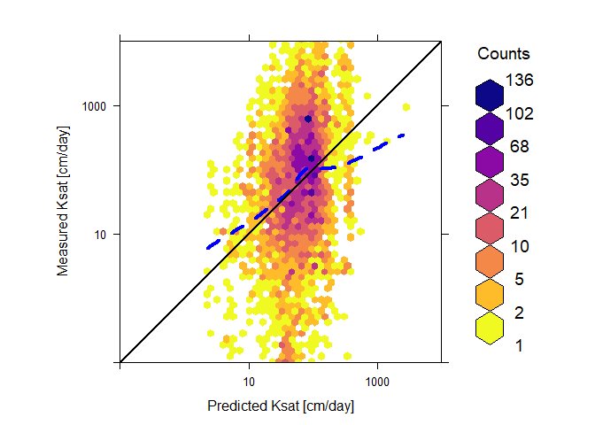

Global prediction of soil saturated hydraulic conductivity using random
forest in a Covariate-based Geo Transfer Functions (CoGTF) framework
================
Surya Gupta, Tom Hengl, Peter Lehmann, Sara Bonetti, Dani Or

  - [Selection of Grids randomly for spatial
    cross-validation](#selection-of-grids-randomly-for-spatial-cross-validation)
  - [Selection of Covaraites](#selection-of-covaraites)
  - [Fitting of models](#fitting-of-models)

Soil saturated hydraulic conductivity (Ksat) is one of the prominent
soil hydraulic properties used in the modeling of land surface
processes. Ksat is often derived using limited dataset and soil basic
properties likely soil texture, bulk density) by means pedotransfer
functions (PTFs). We propose here an integrated Predictive Soil Modeling
(PSM) framework where soil variables are combined with RS-based
covariates using the Random Forest method. We refer to this approach as
the “Covariate-based Geo Transfer Functions” (CoGTF). Here, the
objective of this report to show the methods used to develop the CoGTF
with R code and stepwise description.

SoilKsatDB [link](https://doi.org/10.5281/zenodo.3752721)

CoGTF global Ksat maps [link](https://doi.org/10.5281/zenodo.3934853)

To cite this maps please use:

Gupta, S., Hengl, T., Lehmann, P., Bonetti, S., Papritz, A. and Or, D.:
[Global prediction of soil saturated hydraulic conductivity using random
forest in a Covariate-based Geo Transfer Functions (CoGTF)
framework](https://www.essoar.org/doi/10.1002/essoar.10503663.1).
manuscript submitted to Journal of Advances in Modeling Earth Systems
(JAMES).

``` r
library(caret)
```

    ## Loading required package: lattice

    ## Loading required package: ggplot2

``` r
library(randomForest)
```

    ## randomForest 4.6-14

    ## Type rfNews() to see new features/changes/bug fixes.

    ## 
    ## Attaching package: 'randomForest'

    ## The following object is masked from 'package:ggplot2':
    ## 
    ##     margin

``` r
library(ranger)
```

    ## 
    ## Attaching package: 'ranger'

    ## The following object is masked from 'package:randomForest':
    ## 
    ##     importance

``` r
library(mlr)
```

    ## Loading required package: ParamHelpers

    ## 'mlr' is in maintenance mode since July 2019. Future development
    ## efforts will go into its successor 'mlr3' (<https://mlr3.mlr-org.com>).

    ## 
    ## Attaching package: 'mlr'

    ## The following object is masked from 'package:caret':
    ## 
    ##     train

``` r
library(tibble)
library(raster)
```

    ## Loading required package: sp

    ## 
    ## Attaching package: 'raster'

    ## The following object is masked from 'package:mlr':
    ## 
    ##     resample

    ## The following object is masked from 'package:ParamHelpers':
    ## 
    ##     getValues

``` r
library(sp)
library(rgdal)
```

    ## rgdal: version: 1.5-12, (SVN revision 1018)
    ## Geospatial Data Abstraction Library extensions to R successfully loaded
    ## Loaded GDAL runtime: GDAL 3.0.4, released 2020/01/28
    ## Path to GDAL shared files: C:/Users/guptasu.D/Documents/R/win-library/3.6/rgdal/gdal
    ## GDAL binary built with GEOS: TRUE 
    ## Loaded PROJ runtime: Rel. 6.3.1, February 10th, 2020, [PJ_VERSION: 631]
    ## Path to PROJ shared files: C:/Users/guptasu.D/Documents/R/win-library/3.6/rgdal/proj
    ## Linking to sp version:1.4-2
    ## To mute warnings of possible GDAL/OSR exportToProj4() degradation,
    ## use options("rgdal_show_exportToProj4_warnings"="none") before loading rgdal.

``` r
library(hexbin)
library(lattice)
library(RColorBrewer)
library(viridis)
```

    ## Loading required package: viridisLite

``` r
library(Metrics)
```

    ## 
    ## Attaching package: 'Metrics'

    ## The following objects are masked from 'package:caret':
    ## 
    ##     precision, recall

``` r
ksat_df<-read.csv("E:/Ksat_dataset_mapping.csv")

## Unique IDs for 1 degrees by 1 degrees

## Spatial ID:
pol.100km = readOGR("E:/Ksat/tiles_ll_100km_mask.shp")
```

    ## OGR data source with driver: ESRI Shapefile 
    ## Source: "E:\Ksat\tiles_ll_100km_mask.shp", layer: "tiles_ll_100km_mask"
    ## with 18653 features
    ## It has 9 fields

``` r
sp.pnts = ksat_df[,c("longitude_decimal_degrees", "latitude_decimal_degrees")]
ov.ID = sp::over(SpatialPoints(sp.pnts, proj4string = CRS(proj4string(pol.100km))), pol.100km["ID"])
```

    ## Warning in proj4string(pol.100km): CRS object has comment, which is lost in
    ## output

``` r
summary(is.na(ov.ID$ID))
```

    ##    Mode   FALSE 
    ## logical    6814

``` r
ksat_df$ID = ov.ID$ID


source("E:/OpenLandMap/R/saveRDS_functions.R")
source("E:/OpenLandMap/R/LandGIS_functions.R")

## saveRDS_functions.R and LandGIS_functions.R available at https://github.com/Envirometrix/LandGISmaps/tree/477460d1d0099646c508f65e68769b9edf050ce8/functions

## 3D modeling (see Hengl, T., & MacMillan, R. A. (2019). Predictive soil mapping with R. Lulu. com.)

dfs <- hor2xyd(ksat_df, U="hzn_top", L="hzn_bot")


I.vars = make.names(unique(unlist(sapply(c("s.no","clm_", "dtm_", "lcv", "veg_", "olm_c", "olm_s", "olm_bd", "ID", "DEPTH"), function(i){names(dfs)[grep(i, names(dfs))]}))))

t.vars = c("log_ksat")
sel.n <- c(t.vars,I.vars)
sel.r <- complete.cases(dfs[,sel.n])
PTF_temp2 <- dfs[sel.r,sel.n]

unique(PTF_temp2$ID)
```

    ##   [1] 9323  40505 40506 40865 40866 36280 36281 36279 36639 36282 36638 32609
    ##  [13] 32610 32249 32654 30460 37521 37741 38101 48547 49239 43965 44339 46847
    ##  [25] 42385 44485 36797 33550 33551 25024 36445 36444 38712 6111  36824 34297
    ##  [37] 38944 45393 45395 35384 35023 33216 35022 34662 35017 38610 35740 32340
    ##  [49] 39429 39428 39069 39068 26375 34641 37154 36089 38347 37168 25658 33378
    ##  [61] 24300 33330 33332 33691 40858 30508 24054 41579 45201 23682 23332 22615
    ##  [73] 7168  34296 36466 36826 33909 35340 14177 33020 36791 37149 33015 33016
    ##  [85] 30140 29778 35364 35363 32500 33215 32498 31779 31420 32139 32857 32859
    ##  [97] 32140 33218 20293 14178 14170 20630 20631 11289 14898 20661 14539 16331
    ## [109] 17781 21364 13452 34483 34482 33752 34460 34101 34100 33935 35021 34661
    ## [121] 33574 35743 38941 34269 41230 40149 40870 40509 41231 41234 41242 29903
    ## [133] 29902 27183 7916  8277  35699 41235 41233 40872 36917 37277 39091 30509
    ## [145] 34651 9326  42313 42311 42310 42670 41227 37985 35471 25015 27524 42339
    ## [157] 39825 41590 33792 35867 35507 35868 36228 36226 35866 36817 35356 35739
    ## [169] 35509 35508 34738 34071 36194 36652 37260 35152 36180 35456 35816 35510
    ## [181] 41953 33937 39440 35095 33017 26468 28699 26474 30860 24308 36796 25389
    ## [193] 34624 34056 31574 36557 40154 39782 13091 13090 25740 29437 12181 35147
    ## [205] 21360 32993 36924 35844 30834 23592 39796 25742 41226 40504 34416 33204
    ## [217] 11647 33722 33362 37736 26804 22895 38345 38705 41576 40497 42297 41217
    ## [229] 41577 35921 10737 42549 40515 10190 35581 35570 34849 36657 32332 38466
    ## [241] 34139 21818 31041 40882 31550 29383 12812 35815 27576 39336 38960 19295
    ## [253] 34042 35730 16037 16038 35843 15086 24298 24299 34629 33910 10197 19297
    ## [265] 36795 36892 38262 10736 34043 37263 10195 10194 9835  10555 9834  32229
    ## [277] 36435 34994 17233 9328  37497 11487 10039 12090 9841  37612 13653 21882
    ## 18653 Levels: 10015 10016 10017 10018 10019 10020 10022 10023 10024 ... 9926

# Selection of Grids randomly for spatial cross-validation

``` r
## We have a total of 289 grids that contain data. We have divided the samples into 57 grids for each set. 
##Set1
set.seed(17)
chosen <- sample(unique(PTF_temp2$ID), 57)

ff<-subset(PTF_temp2, ID %in% chosen)

final<-PTF_temp2[!(PTF_temp2$ID %in% ff$ID),]

set.seed(18)
chosen <- sample(unique(final$ID), 57)

ff1<-subset(final, ID %in% chosen)

final1<-final[!(final$ID %in% ff1$ID),]


set.seed(19)
chosen <- sample(unique(final1$ID), 57)

ff2<-subset(final1, ID %in% chosen)

final2<-final1[!(final1$ID %in% ff2$ID),]


set.seed(20)
chosen <- sample(unique(final2$ID), 57)

ff3<-subset(final2, ID %in% chosen)

final3<-final2[!(final2$ID %in% ff3$ID),]


df1<-ff
df2<-ff1
df3<-ff2
df4<-ff3
df5<-final3


Train1<- rbind(ff, ff1, ff2, ff3)

Train2<- rbind (ff1, ff2, ff3,final3)

Train3<- rbind(ff2, ff3,final3, ff)

Train4<- rbind(ff3,final3, ff,ff1)

Train5<- rbind(final3, ff,ff1, ff2)
```

# Selection of Covaraites

``` r
grid <- list.files("E:/maps_tests/new_layers/layers_RS/" , pattern = "*.tif$")
All_cov <- raster::stack(paste0("E:/maps_tests/new_layers/layers_RS/", grid))

set.seed(2) 
fm.ksat <- as.formula(paste("log_ksat~ ",paste(names(All_cov), collapse = "+")))
fm.ksat
```

    ## log_ksat ~ clm_bioclim.var_chelsa.1_m_1km_s0..0cm_1979..2013_v1.0 + 
    ##     clm_bioclim.var_chelsa.12_m_1km_s0..0cm_1979..2013_v1.0 + 
    ##     clm_bioclim.var_chelsa.13_m_1km_s0..0cm_1979..2013_v1.0 + 
    ##     clm_bioclim.var_chelsa.14_m_1km_s0..0cm_1979..2013_v1.0 + 
    ##     clm_bioclim.var_chelsa.4_m_1km_s0..0cm_1979..2013_v1.0 + 
    ##     clm_bioclim.var_chelsa.5_m_1km_s0..0cm_1979..2013_v1.0 + 
    ##     clm_bioclim.var_chelsa.6_m_1km_s0..0cm_1979..2013_v1.0 + 
    ##     clm_cloud.fraction_earthenv.modis.annual_m_1km_s0..0cm_2000..2015_v1.0 + 
    ##     clm_diffuse.irradiation_solar.atlas.kwhm2.100_m_1km_s0..0cm_2016_v1 + 
    ##     clm_direct.irradiation_solar.atlas.kwhm2.10_m_1km_s0..0cm_2016_v1 + 
    ##     clm_lst_mod11a2.annual.day_m_1km_s0..0cm_2000..2017_v1.0 + 
    ##     clm_lst_mod11a2.annual.day_sd_1km_s0..0cm_2000..2017_v1.0 + 
    ##     clm_precipitation_sm2rain.annual_m_1km_s0..0cm_2007..2018_v0.2 + 
    ##     DEPTH + dtm_aspect.cosine_merit.dem_m_250m_s0..0cm_2018_v1.0 + 
    ##     dtm_elevation_merit.dem_m_250m_s0..0cm_2017_v1.0 + dtm_lithology_usgs.ecotapestry.acid.plutonics_p_250m_s0..0cm_2014_v1.0 + 
    ##     dtm_slope_merit.dem_m_1km_s0..0cm_2017_v1.0 + dtm_twi_merit.dem_m_1km_s0..0cm_2017_v1.0 + 
    ##     lcv_landsat.nir_wri.forestwatch_m_250m_s0..0cm_2014_v1.0 + 
    ##     lcv_landsat.red_wri.forestwatch_m_250m_s0..0cm_2018_v1.2 + 
    ##     lcv_landsat.swir2_wri.forestwatch_m_250m_s0..0cm_2018_v1.2 + 
    ##     lcv_snow_probav.lc100_p_250m_s0..0cm_2017_v1.0 + lcv_wetlands.regularly.flooded_upmc.wtd_p_250m_b0..200cm_2010..2015_v1.0 + 
    ##     olm_bd + olm_clay + olm_sand + veg_fapar_proba.v.annual_d_250m_s0..0cm_2014..2017_v1.0

# Fitting of models

``` r
set.seed(2) 
rm.ksat <- Train1[complete.cases(Train1[,all.vars(fm.ksat)]),]
m.ksat <- ranger(fm.ksat, rm.ksat, num.trees=200, mtry=6, quantreg = TRUE)
m.ksat
```

    ## Ranger result
    ## 
    ## Call:
    ##  ranger(fm.ksat, rm.ksat, num.trees = 200, mtry = 6, quantreg = TRUE) 
    ## 
    ## Type:                             Regression 
    ## Number of trees:                  200 
    ## Sample size:                      13445 
    ## Number of independent variables:  28 
    ## Mtry:                             6 
    ## Target node size:                 5 
    ## Variable importance mode:         none 
    ## Splitrule:                        variance 
    ## OOB prediction error (MSE):       0.4820714 
    ## R squared (OOB):                  0.5846557

``` r
df5$prediction<- predict(m.ksat,df5)$predictions

RMSE(df5$prediction, df5$log_ksat)
```

    ## [1] 1.60256

``` r
## Ist_part is computed

rm.ksat1 <- Train2[complete.cases(Train2[,all.vars(fm.ksat)]),]
m.ksat1 <- ranger(fm.ksat, rm.ksat1, num.trees=200, mtry=6, quantreg = TRUE)
m.ksat1
```

    ## Ranger result
    ## 
    ## Call:
    ##  ranger(fm.ksat, rm.ksat1, num.trees = 200, mtry = 6, quantreg = TRUE) 
    ## 
    ## Type:                             Regression 
    ## Number of trees:                  200 
    ## Sample size:                      15150 
    ## Number of independent variables:  28 
    ## Mtry:                             6 
    ## Target node size:                 5 
    ## Variable importance mode:         none 
    ## Splitrule:                        variance 
    ## OOB prediction error (MSE):       0.554383 
    ## R squared (OOB):                  0.6251995

``` r
df1$prediction<- predict(m.ksat1,df1)$predictions

RMSE(df1$prediction, df1$log_ksat)
```

    ## [1] 1.43325

``` r
## 2nd_part is computed
rm.ksat2 <- Train3[complete.cases(Train3[,all.vars(fm.ksat)]),]
m.ksat2 <- ranger(fm.ksat, rm.ksat2, num.trees=200, mtry=6, quantreg = TRUE)
m.ksat2
```

    ## Ranger result
    ## 
    ## Call:
    ##  ranger(fm.ksat, rm.ksat2, num.trees = 200, mtry = 6, quantreg = TRUE) 
    ## 
    ## Type:                             Regression 
    ## Number of trees:                  200 
    ## Sample size:                      14827 
    ## Number of independent variables:  28 
    ## Mtry:                             6 
    ## Target node size:                 5 
    ## Variable importance mode:         none 
    ## Splitrule:                        variance 
    ## OOB prediction error (MSE):       0.5561109 
    ## R squared (OOB):                  0.680943

``` r
df2$prediction<- predict(m.ksat2,df2)$predictions

RMSE(df2$prediction, df2$log_ksat)
```

    ## [1] 0.9097999

``` r
## 3rd_part is computed

rm.ksat3 <- Train4[complete.cases(Train4[,all.vars(fm.ksat)]),]
m.ksat3 <- ranger(fm.ksat, rm.ksat3, num.trees=200, mtry=6, quantreg = TRUE)
m.ksat3
```

    ## Ranger result
    ## 
    ## Call:
    ##  ranger(fm.ksat, rm.ksat3, num.trees = 200, mtry = 6, quantreg = TRUE) 
    ## 
    ## Type:                             Regression 
    ## Number of trees:                  200 
    ## Sample size:                      13455 
    ## Number of independent variables:  28 
    ## Mtry:                             6 
    ## Target node size:                 5 
    ## Variable importance mode:         none 
    ## Splitrule:                        variance 
    ## OOB prediction error (MSE):       0.5007371 
    ## R squared (OOB):                  0.7175074

``` r
df3$prediction<- predict(m.ksat3,df3)$predictions

RMSE(df3$prediction, df3$log_ksat)
```

    ## [1] 0.9517942

``` r
## 4th_part is computed
rm.ksat4 <- Train5[complete.cases(Train5[,all.vars(fm.ksat)]),]
m.ksat4 <- ranger(fm.ksat, rm.ksat4, num.trees=200, mtry=6, quantreg = TRUE)
m.ksat4
```

    ## Ranger result
    ## 
    ## Call:
    ##  ranger(fm.ksat, rm.ksat4, num.trees = 200, mtry = 6, quantreg = TRUE) 
    ## 
    ## Type:                             Regression 
    ## Number of trees:                  200 
    ## Sample size:                      15039 
    ## Number of independent variables:  28 
    ## Mtry:                             6 
    ## Target node size:                 5 
    ## Variable importance mode:         none 
    ## Splitrule:                        variance 
    ## OOB prediction error (MSE):       0.5431854 
    ## R squared (OOB):                  0.6833854

``` r
df4$prediction<- predict(m.ksat4,df4)$predictions

RMSE(df4$prediction, df4$log_ksat)
```

    ## [1] 0.983291

``` r
Final_data<- rbind(df1,df2,df3,df4,df5)

#dd<- aggregate(Final_data[, 1:34], list(Final_data$s.no), mean)


ll<- lm(Final_data$prediction~ Final_data$log_ksat)

RMSE(Final_data$prediction,Final_data$log_ksat)
```

    ## [1] 1.225585

``` r
summary(ll)
```

    ## 
    ## Call:
    ## lm(formula = Final_data$prediction ~ Final_data$log_ksat)
    ## 
    ## Residuals:
    ##      Min       1Q   Median       3Q      Max 
    ## -1.50052 -0.15380  0.03805  0.19936  1.55287 
    ## 
    ## Coefficients:
    ##                     Estimate Std. Error t value Pr(>|t|)    
    ## (Intercept)         1.655977   0.004029  411.00   <2e-16 ***
    ## Final_data$log_ksat 0.066046   0.001944   33.97   <2e-16 ***
    ## ---
    ## Signif. codes:  0 '***' 0.001 '**' 0.01 '*' 0.05 '.' 0.1 ' ' 1
    ## 
    ## Residual standard error: 0.328 on 17977 degrees of freedom
    ## Multiple R-squared:  0.06032,    Adjusted R-squared:  0.06027 
    ## F-statistic:  1154 on 1 and 17977 DF,  p-value: < 2.2e-16

``` r
ccc = DescTools::CCC(Final_data$prediction,Final_data$log_ksat, ci = "z-transform", conf.level = 0.95, na.rm=TRUE)$rho.c
ccc
```

    ##         est    lwr.ci    upr.ci
    ## 1 0.1221846 0.1151756 0.1291814

``` r
Final_data$log_ksat1<- 10^Final_data$log_ksat
Final_data$prediction1<- 10^Final_data$prediction

hexbinplot(log_ksat1~ prediction1, 
           panel = function(x, y, ...){
             panel.hexbinplot(x, y, ...)
             panel.loess(x, y,span = 2/3, col.line = "blue",type="l", lty=2, lwd = 4)
             panel.abline(c(0, 1),lwd = 2)
           },
           data = Final_data,xlab = "Predicted Ksat [cm/day]", ylab = "Measured Ksat [cm/day]",cex.axis = 4, aspect="1", xbins=30, colramp = function(n) {viridis (8,  alpha = 1, begin = 0, end = 1, direction = -1,option = "C")},xlim=c(0.1,10000), ylim=c(0.1,10000),
           scales=list(
             x = list(log = 10, equispaced.log = FALSE), 
             y = list(log = 10, equispaced.log = FALSE)
           ),
           font.lab= 6, cex.labels = 1.2,font.axis = 2,colorcut=c(0,0.01,0.03,0.07,0.15,0.25,0.5,0.75,1) )
```

<!-- -->

``` r
##Fitting final model

#rm.ksat <- PTF_temp2[complete.cases(PTF_temp2[,all.vars(fm.ksat)]),]
#m.ksat <- ranger(fm.ksat, rm.ksat, num.trees=200, mtry=6, quantreg = TRUE)
#m.ksat


##Importance variable
#m.ksat <- randomForest(fm.ksat, rm.ksat, num.trees=200, mtry=6, quantreg = TRUE)

#varImpPlot(m.ksat, sort=TRUE, n.var=min(30, nrow(m.ksat$importance)))

## Then Produced the final CoGTF map

#p2 = predict(All_cov,m.ksat, progress='window',type = "response",fun = function(model, ...) predict(model, ...)$predictions)

#writeRaster(p2, "/home/step/data/OpenLandMap/Final_selected_covariates/New_raster_layer/Final_RF_0cm.tif")
```
